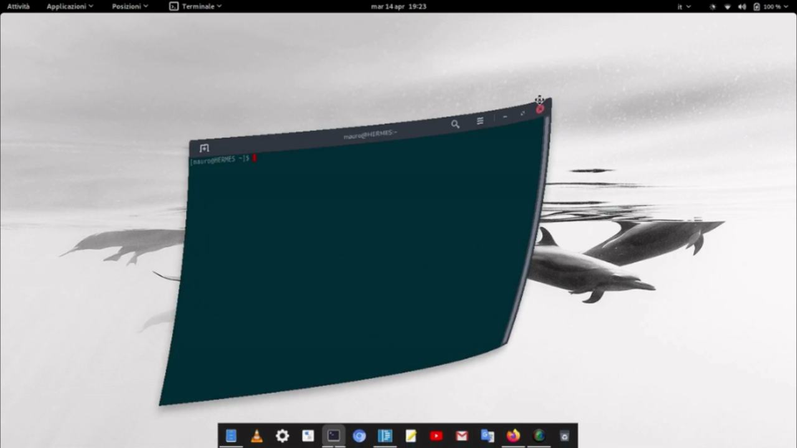

# Compiz alike windows effect for GNOME Shell

Simplified "Compiz alike" wobbly windows effect.

## Installation

You can install this extension by visiting [the GNOME Shell Extensions page](https://extensions.gnome.org/extension/2950/compiz-alike-windows-effect/) for this extension.

## Alternative
Please consider this extension as a fallback.
If you prefer an effect more similar to the original, you can opts to use the following GNOME Shell Extensions alternative:
https://extensions.gnome.org/extension/3210/compiz-windows-effect
